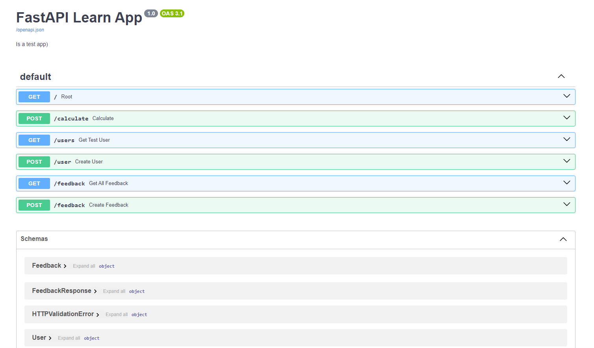
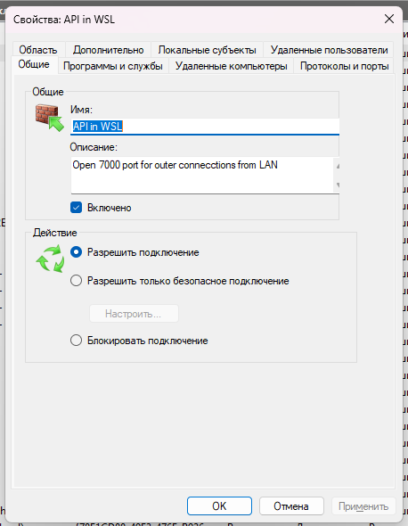

# Test app for learn FastAPI



## Run local

- For work in network

    ```bash
    uvicorn app.main:app --reload --port 8000 --host 0.0.0.0
    ```
- For work in local machine

    ```bash
    uvicorn app.main:app --reload --port 8000 --host localhost
    ```

---

it is written on the course https://stepik.org/course/179694/syllabus

---
> :pushpin: :wrench: For proxy port from Windows to WSL:

> 1) Add rule in Windows `netsh` for proxy to WSL:
> > ```cmd
> > netsh interface portproxy add v4tov4 listenport=<yourPortToForward> listenaddress=0.0.0.0 connectport=<yourPortToConnectToInWSL> connectaddress=(wsl hostname -I)
> > ```
> > Example (add rule):
> > ```cmd
> > netsh interface portproxy add v4tov4 listenport=7000 listenaddress=0.0.0.0 connectport=7000 connectaddress=172.21.67.20
> > ```
> > Example (delete rule):
> > ```cmd
> > netsh interface portproxy delete v4tov4 listenport=7000 listenaddress=0.0.0.0
> > ```
>
> 2) Add rule in Windows `Brandmauer`
> > 
